# BAE305_Project_OnlineDesignFile

Colliding Planets Group

Plant Montoring System Project 

BAE 305 Spring 2026

Members:

Grace Benton, Evie Hamliton, Cami Morgan, Allison Lundy, and Ada Lasley

## Summary

The Plant Monitoring System was designed to automatically water indoor plants while also monitoring ambient temperature. The system meets all project objectives by detecting 
soil moisture, dispensing water when soil is dry, providing LED status indicators, allowing the user to set an acceptable temperature range, and alerting the user when the 
temperature moves outside that range.

The project uses two Arduino-based control boards. Board 1 manages temperature monitoring with a thermistor, LCD screen, pushbuttons, and piezo buzzer. Board 2 controls soil 
moisture monitoring and watering using a moisture sensor, RGB LED, relay, diaphragm pump, and water reservoir. A custom walnut base was built to securely hold all components 
while separating the water tank from the electronics for safety.

Testing showed the system successfully detected dry soil, activated watering, and stopped once proper moisture levels were reached. The temperature system also correctly 
displayed readings and activated the buzzer when temperatures moved outside the selected range. Overall, the project successfully created a reliable and practical self-
watering plant monitoring system.

## Materials 

| Material / Component | Quantity |
|---|---:|
| Walnut Wood | 571 in² |
| Torx Head Screws | 11 |
| SparkFun RedBoards | 2 |
| Breadboard | 1 |
| Velcro Tape (3/4 in wide) | 6 in |
| 4-AA Battery Packs | 2 |
| 8-AA 12V Battery Holder | 1 |
| Clear Tubing (3/16 in Inner Diameter) | As Needed |
| Emitter Tubing (1/4 in) | As Needed |
| Analog Soil Moisture Sensor | 1 |
| 2.5 L Storage Container | 1 |
| DC 12V Self-Priming Diaphragm Pump | 1 |
| 10 kΩ Resistors | 5 |
| 12VDC 1-Channel Relay Module | 1 |
| RGB LED (Common Cathode) | 1 |
| I2C Serial Interface Adapter Module | 1 |
| 16x2 LCD Display Screen | 1 |
| 10 kΩ Thermistor | 1 |
| Piezo Buzzer | 1 |
| Pushbuttons | 3 |

## Project Setup and Schematics 

The plant monitoring system is designed using two separate Arduino-based control boards to independently manage temperature monitoring and soil moisture monitoring with a 
container to hold the water. The system will sit next to the plant it will monitor with the emitter tubing wraping around the base of the plant and the soil moistor sensor in 
the pot as shown in figures below.

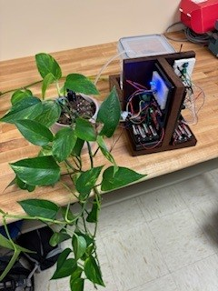

*Figure 1. Complete plant monitoring system showing both Arduino boards, water reservoir, tubing, and mounted components.*

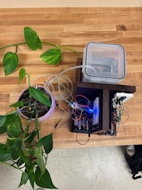

*Figure 2. Top view of the complete plant monitoring system layout showing component placement and system organization.*

### Base

Below is the construction overveiw for the base of the plant monitoring system, designed to support all additional system components.

[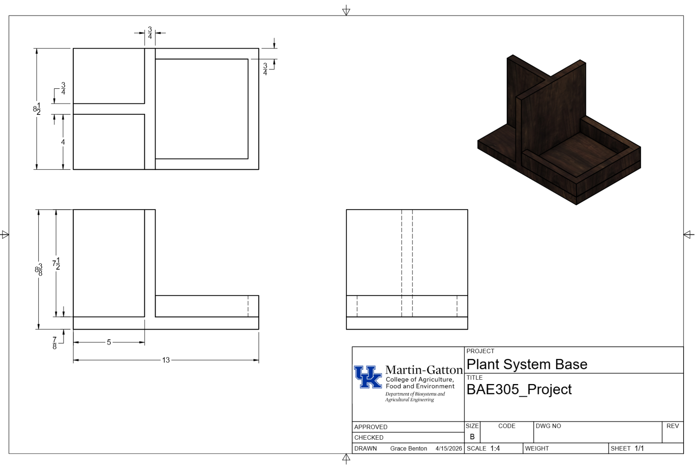](./BAE305_Project_Drawing.pdf)

*Figure 3. Click the image above to view the full PDF drawing.*

The main base was made from a walnut board that was first planed to a thickness of 7/8 inch. It was then cut to 13 inches in length using the chop saw. One edge was jointed 
to create a straight reference edge, and the board was then cut on the table saw to a final width of 8.5 inches.

The remaining walnut board was then planed to a thickness of 3/4 inch. From this material, two pieces were cut to 7.5 inches in length using the chop saw. Both pieces were 
jointed on one edge and then cut on the table saw, with one piece finished to 8.5 inches wide and the other finished to 5 inches wide.

Next, another board section was cut to 8.5 inches in length and then ripped into three strips, each measuring 1.5 inches wide. Two of these strips were then cut down to 6.5 
inches in length.

Once all pieces were prepared, they were arranged according to the base design drawing. The assembly was secured using Torx head screws. Two screws were used per piece from 
the bottom for structural support, and one additional screw was used to secure the T-shaped support section together. Then, a hole was drilled with a hand drill and 1/4 $in$ 
bit in the corner of the lid 1 1/4 $in$ from both sides. 

### Adurino Board 1: Tempature Sensor and Screen

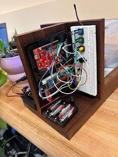

*Figure 4. Board 1 setup showing the temperature monitoring system with the LCD screen, thermistor, pushbuttons, and piezo buzzer.*

Board 1 is responsible for temperature monitoring and user interaction. This board includes a 10KΩ thermistor temperature sensor, a 10KΩ resistor, 16x2 LCD display, I2C 
Serial Interface Adapter Module, three pushbuttons, Backery Pack that holds 4 AAs and a piezo buzzer.

The complete schematic, wiring diagram, and code for Board 1 provide all electrical connections and programming necessary for proper assembly, and system operation.

[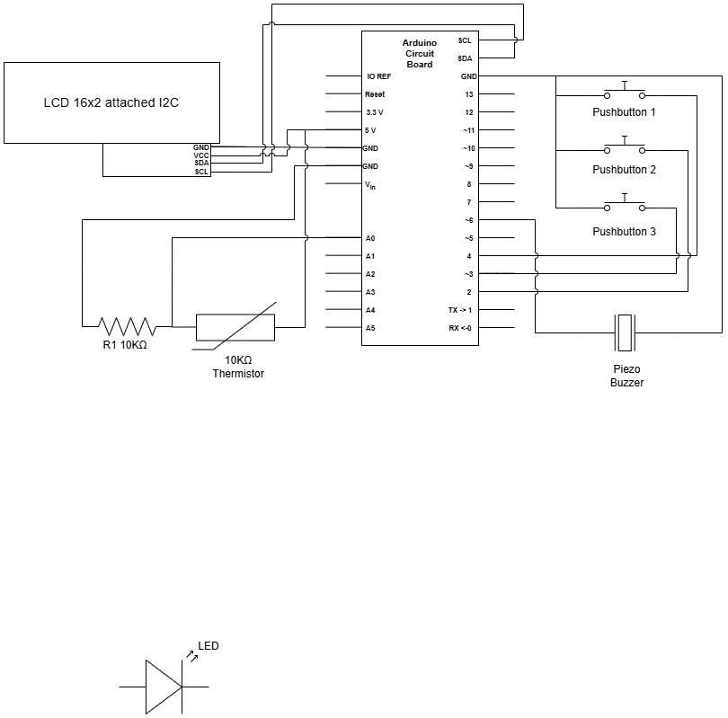](./BAE305_Schematic_Board1_Tempature.drawio.png)

*Figure 5. Circuit schematic for Board 1 showing the temperature monitoring system with LCD display, pushbuttons, piezo buzzer, thermistor, and resistor connections.*

[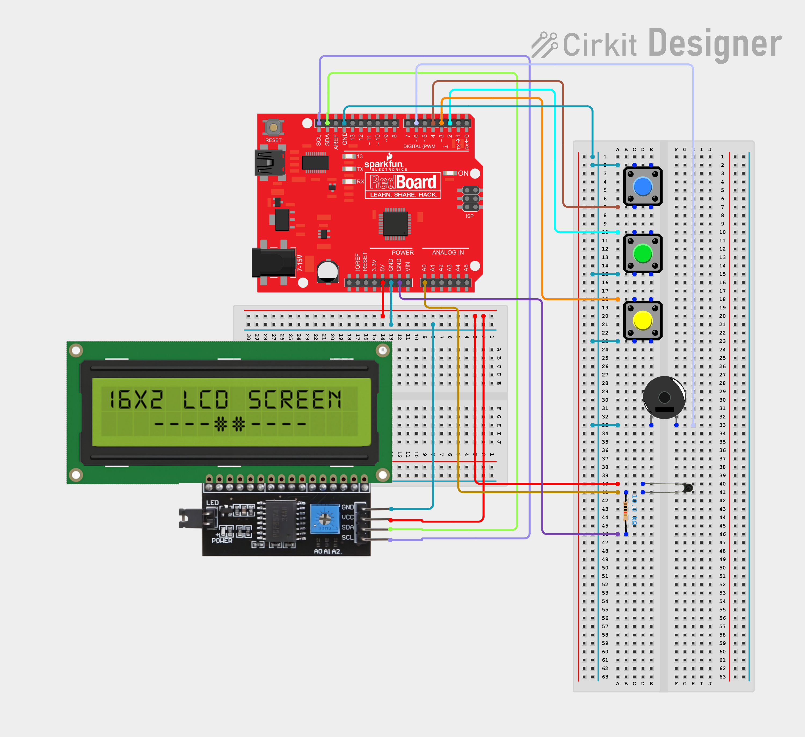](./Wire_Diagram_Board1_Temp.png)

*Figure 6. Physical wiring diagram for Board 1 showing the full component layout and breadboard connections for the temperature monitoring system with LCD display, 
pushbuttons, piezo buzzer, and thermistor.*

*Board 1 Arduino Code – Temperature Monitoring System*

[Click here to view the code file](./BAE305_Board1_Tempature_Code)

### Audurino Board 2: Mositure Sensor and Water Pump

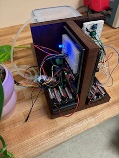

*Figure 7. Board 2 setup showing the watering system with the soil moisture sensor, relay, RGB LED, and pump connections.*

Board 2 is responsible for monitoring soil moisture levels and controlling the automatic watering system. This board uses an anolog soil moisture sensor, RGB LED common 
cathode, 12V DC 1 channel relay module, DC 12V Diaphram Pump, and external eight AA 12V Battery Pack, 4 10KΩ Resistors, and Backery Pack that holds 4 AAs.

The complete schematic, wiring diagram, and code for Board 2 provide the necessary electrical connections, programming, and documentation for full system assembly, and 
operation.

[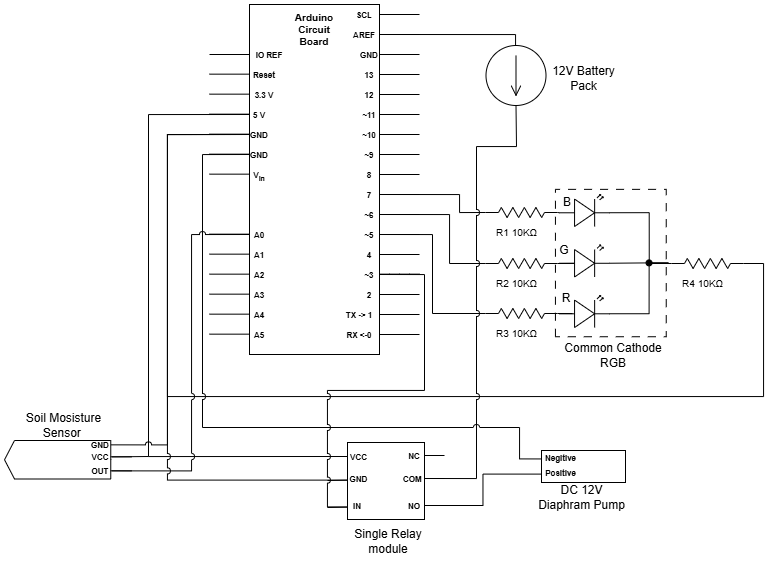](./BAE305_Schematic_Board2_Moisture.drawio.png)

*Figure 8. Circuit schematic for Board 2 showing the soil moisture monitoring system with RGB LED, soil moisture sensor, relay module, diaphragm pump, and battery pack 
connections.*

[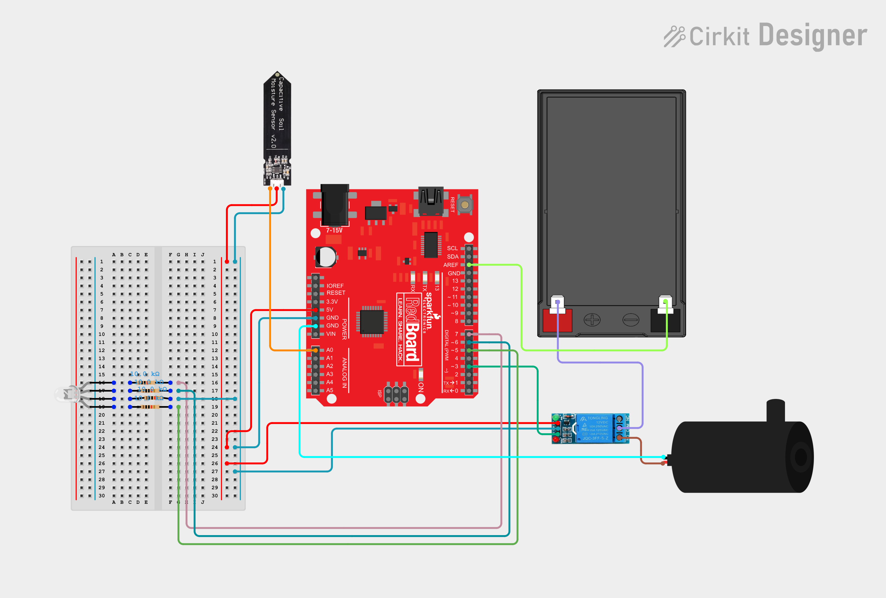](./Wire_Diagram_Board2_Moisture.png)

*Figure 9. Physical wiring diagram for Board 2 showing the full component layout and breadboard connections for the soil moisture monitoring and automatic watering system.*

 *Board 2 Arduino Code – Moisture Monitoring and Watering System*
 
[Click here to view the code file](./incert name of file here)

## Design Decision Discussion

The self-watering plant monitoring system was designed to meet all required project objectives while remaining simple to assemble, reliable for long-term use, and practical 
for everyday indoor plant care. The team decided goals and objective are as follows: device must be able to determine if soil is wet or dry, device must be able 
to automatically dispense water when it determines soil is dry, device must indicate watering system status to user, user must be able to input an acceptable temperature 
range, and device will alert user if ambient air temperature is outside of the inputted temperature range. To achive the objectives the system was divided into two separate 
Arduino-based control boards: one dedicated to watering and soil moisture monitoring, and the other dedicated to temperature monitoring and user interaction. This separation 
improved organization, simplified troubleshooting, and allowed each subsystem to operate independently without interfering with the other.

### Adurino Board 1: Tempature Sensor and Screen

Temperature Sensing:
A thermistor was selected as the temperature sensor because the team had previously used thermistors in earlier Arduino labs and had existing experience with both the wiring 
and programming required. The thermistor was also included in the Arduino kits already available for the project, making it a practical and cost-effective option. Its simple 
circuit design and reliable analog readings made it an effective choice for monitoring plant temperature conditions.

User Interface:
A 16x2 LCD screen with an I2C Serial Interface Adapter Module was selected to display temperature readings and user settings. The I2C adapter greatly simplified the wiring by 
reducing the number of required connections to only four wires: power, ground, SDA, and SCL. This reduced circuit complexity and made assembly cleaner and easier to 
troubleshoot.Three pushbuttons were used for user input: One button to select the parameter, one to increase the value, and the other to decrease the value. These buttons 
allow the user to set both the minimum and maximum acceptable temperature range for the plant. The team chose pushbuttons instead of a full keypad because only two numerical 
values needed adjustment. A keypad would have added unnecessary complexity to both the wiring and programming. The three-button system created a simpler, cleaner, and more 
efficient design. The team also chose a physical screen and button interface instead of using a computer or phone application. A computer-based system would require the user 
to connect an external device each time they wanted to adjust settings, making the process inconvenient. A phone application was also avoided because many app systems are 
better supported on Android devices and could limit accessibility for Apple users. The onboard screen and button system made the device fully self-contained and easier for 
any user to operate.

Alert System:
A piezo buzzer was selected to alert the user when the measured temperature moves outside the selected acceptable range. The buzzer was included in the Arduino kits and had 
also been used in previous coursework, so the team was already familiar with its wiring and programming. This made implementation simple while providing an effective audible 
warning system for the user.

System Operation and Control Decisions:
Using the three pushbuttons the user will input the ideal tempature rang for thier plant. Pushbutton 2 is up by 0.5 degrees Farnhit, pushbutton 3 is down by 0.5 degrees 
farnhight, and pushbutton 1 uploads imputed temputure range to adurino board. The thermistor continuously measures ambient temperature and sends analog input data to the 
Arduino RedBoard. The Arduino processes this data and displays both the current temperature readings and inputed range. The piezo buzzer provides audible alerts when 
temperature goes outside of inputed range. This board serves as the main user interface for the plant monitoring system, allowing real-time monitoring of plant conditions 
while providing feedback through both visual and audible outputs.

> *Note: Cami and Evie I think i got it good on the operation but please add or change to what you guys want. if there is any more explaination that could be given on why we 
want it coded or run this way please add to the above section or sections if it is better explained on why we chose to use that compent in the circut.**please deleate this 
after it is done*

### Audurino Board 2: Mositure Sensor and Water Pump

Water Delivery Method:
For the watering system, a 12V DC self-priming diaphragm pump was selected as the water delivery method. The Arduino sends commands to the pump to activate watering when the 
soil moisture sensor detects dry soil conditions. This pump was chosen because it was easily obtainable, compatible with the Arduino-controlled relay system, and capable of 
providing enough pressure to move water through the tubing system to the plant. It also provided the simplest and most reliable method for controlled water delivery.

Water Tank:
A 2.5-liter sealed storage container was selected as the water tank. The team wanted a container that could safely hold enough water for approximately one week of 
watering while minimizing the risk of water spilling near electrical components. A sealed container with a removable lid helped reduce the risk of water exposure to the 
electronics while still allowing tubing access through a drilled opening in the lid. Because the container is plastic, modifying it for tubing installation was simple. The 
tank can also be easily removed from the system for refilling without disturbing the electronics, improving both safety and user convenience.

Irrigation Tubing System:
Emitter tubing was selected to evenly distribute water throughout the plant pot. A flexible 1/4-inch emitter tube with 6-inch hole spacing allows water to be dispersed around 
the plant rather than concentrated in one location. This improves watering consistency and helps provide more accurate soil moisture sensor readings across the pot. Flexible 
tubing also allows the system to adapt to different pot sizes and plant types. Clear 3/16-inch inner diameter tubing was selected between the tank and the pump because it 
matched the required pump connection size, was flexible for routing, and allowed visual confirmation that water was flowing through the system.

Soil Moisture Sensor:
An analog soil moisture sensor module was selected because it was highly compatible with the Arduino RedBoard and operated on the same voltage range as the Arduino outputs. 
Analog readings also allowed the team to create threshold values for dry, moist, and watered soil conditions, improving system control and watering accuracy.

User Status Indicators:
An RGB common cathode LED was selected to communicate system status to the user. The team wanted the user to quickly understand whether the plant was properly watered, 
actively being watered, or if the system detected a problem such as a low water tank. The LED color indicators were designed as follows: Green LED = Soil moisture is at an 
acceptable level and the plant is sufficiently watered, Blue LED = The system is actively watering the plant using the diaphragm pump, Red LED = The soil moisture sensor has 
detected dry soil for an extended period of time, indicating the water reservoir is likely empty or low. Using one RGB LED allowed all three colors to be displayed using a 
single component instead of wiring three separate LEDs, reducing wiring complexity and improving overall design simplicity.

Extra Power Supply:
A 12V battery pack was selected because the diaphragm pump required 12V power for proper operation. This allowed the pump to operate independently from the Arduino’s lower 
voltage system while still being controlled through the circuit.

System Operation and Control Decisions:
For the demonstration, the soil moisture sensor checks the soil moisture every 30 seconds and sends this information to the Arduino RedBoard, although during normal operation 
it takes readings every 10 minutes. Based on the moisture reading, the system determines whether watering is needed and activates the proper visual indicator using the RGB 
LED. After watering is completed, the soil moisture sensor waits 1 minute before taking another moisture reading. For demonstration purposes, the plant is watered for 5 
seconds, while under normal operation the watering cycle runs for 10 seconds. When dry soil is detected, the Arduino sends a signal to the relay module, which controls power 
to the 12V diaphragm pump. The relay allows the low-voltage Arduino board to safely control the higher voltage pump system. The pump then delivers water to the plant until 
the moisture level is restored.

> *Note: Ada when you where talking about how and when the water runs wiht when is sens with the senor this is where u eaplin it in the System Operation and Control Decisions 
above. Wether you keep the wording I wrote while u where talking idc but I woudl keep a note on what we changeit do for our dementration. **please deleate this after it is 
done*

### Base

The base was designed to hold all components securely while keeping the entire system compact, organized, and easy to move as one unit. The team wanted the system to sit flat 
next to the plant, allow easy access to the screen and buttons, and keep the water reservoir separated from the electronics for safety. Because there were two separate 
Arduino boards, the base needed to hold both boards without becoming overly large. The team also wanted the system to be easy to pick up and move as one complete unit while 
allowing the water tank to be removed separately for refilling. A tray-style base design was selected to support all components. To prevent the tank from sliding, a short 
outer wall was added. This wall was kept at only 1.5 inches tall so the tank could still be easily removed.To separate the water reservoir from the electronics and hold both 
Arduino boards upright, the team designed a T-shaped divider system. The top section of the T extends higher than the water tank to act as a splash barrier between the water 
and electronics. The vertical section of the T inside the tray allows one Arduino board to be mounted on each side.Board 1, watering system, was positioned closest to the 
plant because it contains the pump connections, tubing, and soil moisture sensor. Board 2, temperature monitoring and user interface, was placed on the outward-facing side so 
the user could easily view the LCD screen and access the pushbuttons for temperature input. All componets except the water tank are hled in place iwht velcro tape. This 
layout improved safety, usability, and maintenance while keeping the full system compact and organized.

## Test Results Discussion

 > *This is a note get ride of it when section is complete* 
 > *here is what the rubric says this section is: Could another test engineer replicate your tests? All test equipment specified (model numbers) and procedures fully described. 
 > In this section can each of you say how you tested and debuged the code to get the final working code with the system. Ada for yours maybe more detail or hwo you know the 
>  water pump was working? and def. some info of how you tested reading the data of the sensor and knowing how it outputed its data to then use in the code?*
> *Grace thinks: My understanding is that we have the layouts and desin and the defense of why we chose to use what and do what now in this section it is explaining what went 
> wrong or hickups to making it do want we wanted to and then also how did we make sure it ran they way we wanted it.*
> *If any one has photos of you testing somthing that would be great to add in too! if not its ok this thing is getting long lol*
> *put ur info in the desinated board section below*
 
### Adurino Board 1: Tempature Sensor and Screen

### Audurino Board 2: Mositure Sensor and Water Pump

## Test Results 

To begin testing and demonstration of the plant monitoring system, the emitter tubing and soil moisture sensor were placed inside the plant pot as shown below in Figure 10. 
This setup allowed the system to monitor soil moisture levels and automatically deliver water when dry soil conditions were detected.

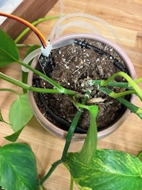

*Figure 10. Plant pot and emitter tubing setup used to evenly distribute water around the plant.*

For demonstration purposes, the soil moisture sensor was programmed to check soil moisture every 30 seconds rather than the normal operating interval of every 10 minutes. 
When the sensor detected dry soil conditions, the system activated the watering cycle. This was indicated by the LED changing to the watering status color, and the diaphragm 
pump began delivering water through the emitter tubing. The increase in soil moisture around the emitter tube during watering is shown in Figure 11.

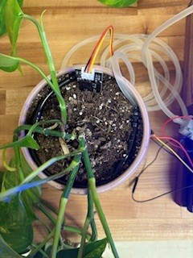

*Figure 11. Water being delivered from the emitter tubing to the plant soil during the watering cycle.*

During the demonstration, the plant was watered for 5 seconds rather than the normal 10-second watering cycle used during standard operation. After watering was completed, 
the system waited 1 minute before taking another moisture reading. This delay allowed time for the water to properly absorb into the soil and prevented false moisture 
readings immediately after watering. Once the soil reached the appropriate moisture level, the system recognized the acceptable condition and the LED changed to green, as 
shown in Figure 12, indicating that the plant had sufficient moisture and no additional watering was needed.

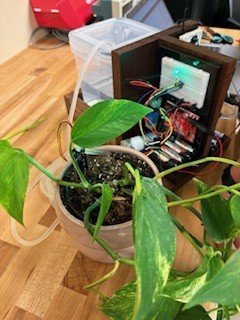

*Figure 12. Green LED indicator showing that the soil moisture is at an acceptable level.*

For temperature monitoring, the acceptable temperature range was manually set around the current room temperature for demonstration purposes using the LCD screen an 
pushbutton controls. The thermistor continuously measured the ambient air temperature and displayed both the measured temperature and the user-selected temperature range on 
the LCD screen. To test the alert system, the thermistor was manually warmed until the measured temperature moved outside the acceptable temperature range. Once the 
temperature exceeded the selected limits, the piezo buzzer activated and continued sounding until the thermistor cooled and returned to the acceptable range.

This demonstration process is summarized and shown in the demonstration video below. The testing was successful, and the project demonstrated that all design objectives were 
successfully met, including soil moisture detection, automatic watering, system status indication, user temperature input, and temperature alert notification.

*Click the image above to watch the full demonstration video of the plant monitoring system in operation.*
